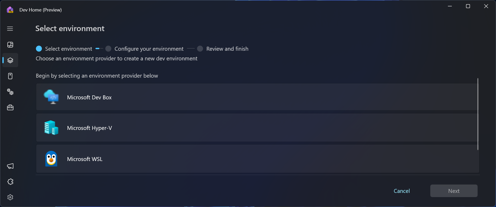

# Environments in Dev Home

> [!IMPORTANT]
> Dev Home will be going away in May 2025 and a subset of its features will be moved to new places. Stay tuned for more information in the following months.

A virtual environment is a self-contained workspace that allows you to maintain separate dependencies and settings for different projects, effectively isolating them from each other. The type of virtual environments supported and maintained by Microsoft currently include:

- [Local Hyper-V virtual machine (VM)](/windows-server/virtualization/hyper-v/get-started/create-a-virtual-machine-in-hyper-v)
- [Microsoft Dev Box](/azure/dev-box/overview-what-is-microsoft-dev-box)
- [Windows Subsystem for Linux (WSL) distribution](/windows/wsl/install)

To add your own environment to Dev Home, see: [Build an extension for Environments in Dev Home](#build-an-extension-for-environments-in-dev-home).

**Environments in Dev Home** centralize your interactions with virtual or cloud environments in a single place.

- View all of your environments in a single place
- Create new environments and quickly configure them with repositories, apps, and packages.
- Perform quick actions such as launch, snapshot, start, stop, or pinning environments to Windows Start menu or taskbar.

## Get started with Environments in Dev Home

To get started using environments in Dev Home, select the **Environments** tab in the left column user interface inside Dev Home. Your existing environments will be displayed here. To create new environments, select **+ Create Environment**.

- **Hyper-V extension**: Installed by default in Dev Home. By default, your local Hyper-V VMs will be visible on the Dev Home Environments page.
  
- **Windows Subsystem for Linux extension**: Installed by default in Dev Home. By default, your local WSL distributions will be visible on the Dev Home Environments page.

- **Microsoft Dev Box**: To display Dev Box cloud environments, install the [Dev Home Azure extension](extensions.md#dev-home-azure-extension). Once installed, each Dev Box that you have in your Azure account will be visible on the Dev Home Environments page.

Each type of environment in Dev Home is supported by a Dev Home extension. To add a new environment, you must ensure that the Dev Home extension supporting the associated environment that you wish to use is installed.

> [!TIP]
> If you do not see the Environments tab in Dev Home or are having trouble, ensure that you have the latest version of Dev Home by running the command: `winget upgrade Microsoft.DevHome`.

## Manage your Environments in Dev Home

Each environment in Dev Home can display some key information:

1. The type of environment (*such as Hyper-V VM, WSL distro, Microsoft Dev Box, more coming soon)*.

2. The name of the environment instance *(whatever name you have chosen for the environment)*.

3. Status of the environment: started, stopped, running.

4. Environment specific information, such as the project name for a Microsoft Dev Box, the vCPU usage, the RAM usage, the storage capacity, the uptime, or checkpoints.

Each virtual environment offers the following quick actions:

1. **Launch**: Connect to or launch the environment.

    - Microsoft Dev Box will launch in the web browser by default. To launch the Dev Box in the new Windows App RDP client for a native experience, install [Windows App](https://www.microsoft.com/store/productId/9N1F85V9T8BN) from Microsoft Store.

2. **Start** or **Stop**: Select the drop-drown arrow beside the Launch button to find the start and stop actions.

3. **Delete**, **Restart**, **Pin to taskbar**: Select the 3-dots above the Launch button to delete, restart, or pin this virtual environment to the Windows Taskbar.

    - The "Pin to Taskbar" and "Pin to Start menu" actions will not appear unless [Windows App](https://www.microsoft.com/store/productId/9N1F85V9T8BN) is installed from Microsoft Store.

4. **Sync**: Select the **Sync** button on the top of the Dev Home Environments window to refresh the list of environments. For example, if you have Dev Home open and simultaneously delete a Hyper-V VM outside of Dev Home, or create a new Microsoft Dev Box in the Azure portal, these changes may not be reflected in Dev Home until you select **Sync** or Dev Home relaunches.

## Create a new environment using Dev Home

To create a new environment:

1. Select **Create Environment** in the Environments or Machine Configuration window of Dev Home.

2. Select the type of environment you would like to create (only supported and installed environment types will be available).

3. Each environment can have different creation parameters, such as name, pool, project, image, and more. These specifications depend on the environment type.
    - For Hyper-V VMs, currently Windows and Linux quick-creation images are supported. Custom images (.iso, .vhd, .vhdx) for VM creation are not yet supported, but are in development.

## Create a WinGet Configuration file for your Dev Home Environment

If your environment has Dev Home installed, you can launch the environment and use the Machine Configuration local setup tool.

Alternatively, you can remotely configure your environment:

1. On the Machine Configuration page in Dev Home, select **Configure an environment**.

2. Choose your existing environment to configure.

3. Select repositories to clone.

4. Select apps to install.

5. Review your configuration. Once complete, the virtual environment will be configured with your selected resources. You may be asked to enter user credentials for the specific environment to apply these changes.

## Build an Extension for Environments in Dev Home

If there is a type of virtual environment that you regularly use that is currently unsupported by Dev Home, you can build your own Dev Home Environment Extension to display the virtual environment in Dev Home.

To build an environment extension, see our guidance and API documentation on GitHub: [Developer environments in Dev Home](https://github.com/microsoft/devhome/blob/main/docs/extensions/environments/readme.md).
